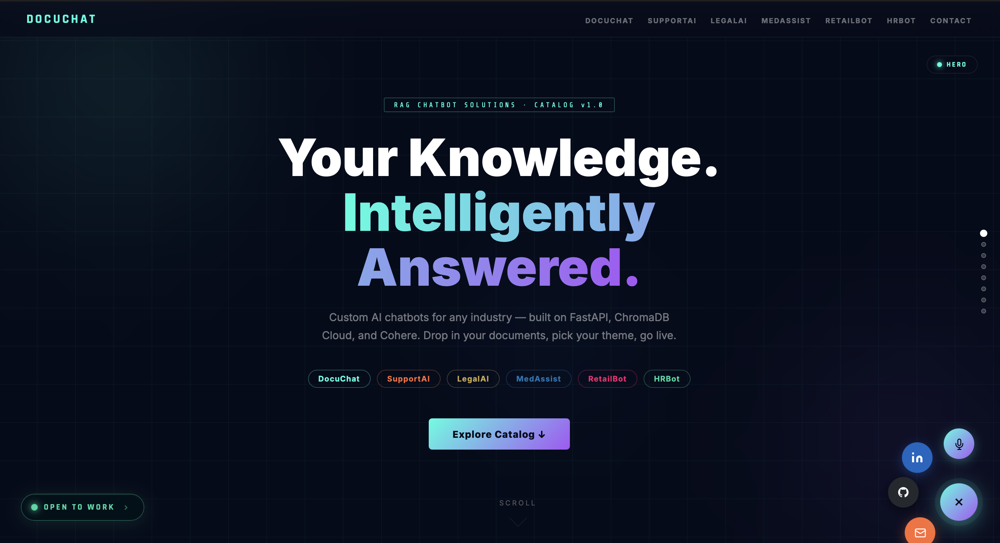
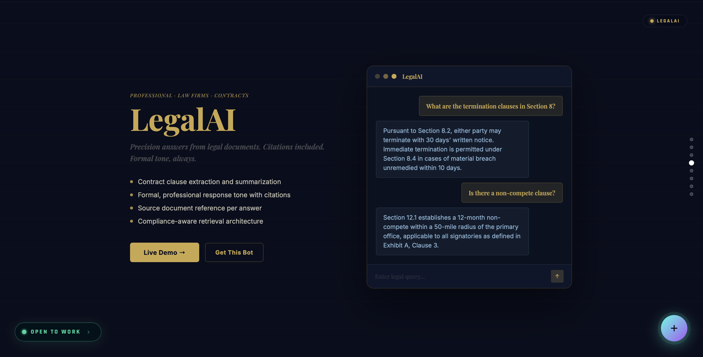
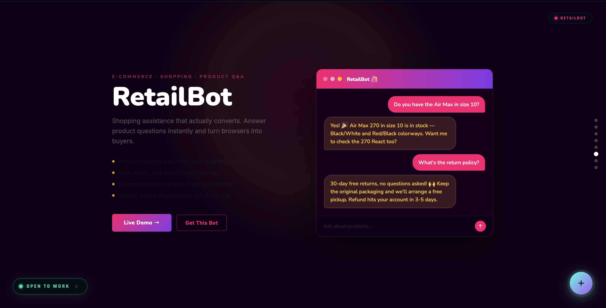
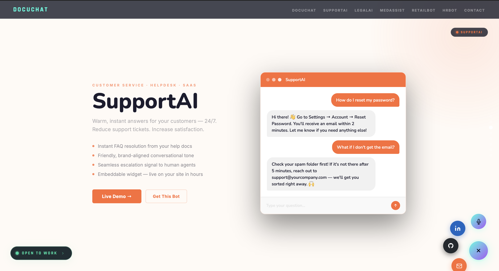
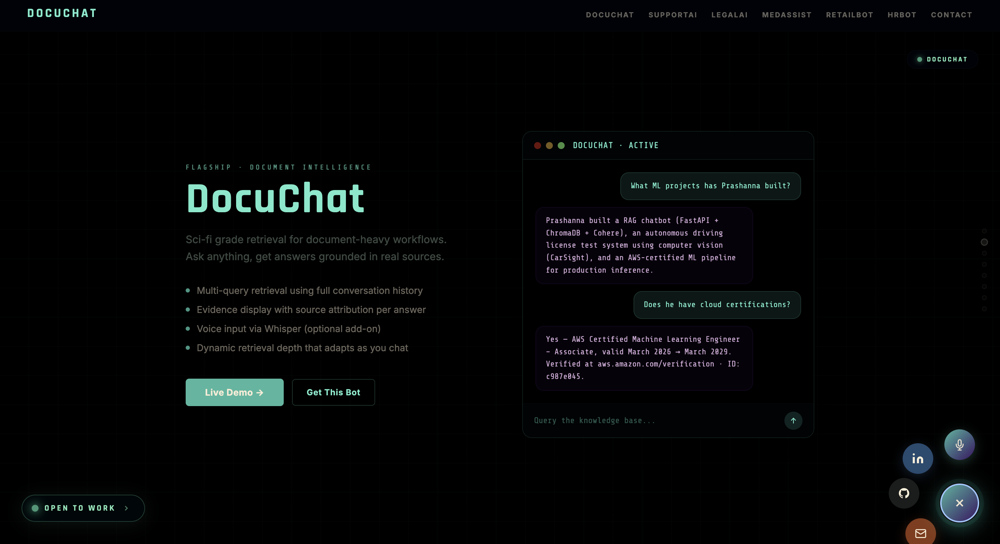
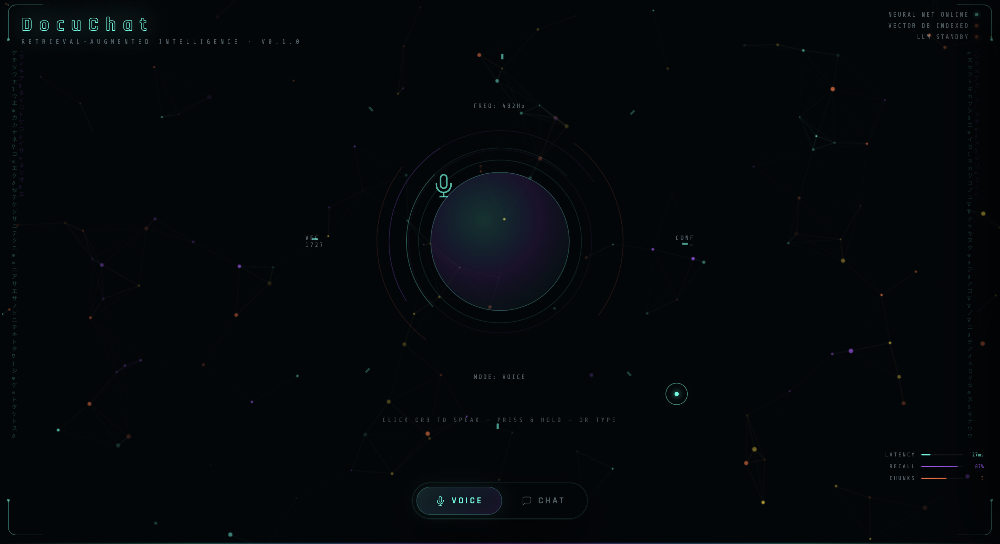

<div align="center">


<br/>

<a href="https://docu-chat.vercel.app/">
  
</a>

<br/><br/>


</div>

---

### [Explore catalog](!https://docu-chat.vercel.app/catalog) (https://docu-chat.vercel.app/catalog)
### [ChatBot](!https://docu-chat.vercel.app/catalog) (https://docu-chat.vercel.app/catalog)

</img>
</img>
</img>
</img>
</img>
</img>

## Overview

DocuChat is a Retrieval-Augmented Generation (RAG) chatbot for querying documents through either text or voice. It retrieves semantically relevant chunks from an indexed knowledge base, sends grounded context to an LLM, and returns answers backed by source evidence.

The system is designed to make document interaction more natural and more reliable. Instead of generating answers from the model alone, DocuChat first retrieves supporting evidence from the indexed document store and uses that evidence during generation. This makes the output more traceable and more useful for knowledge-intensive workflows.

---

## Key Features

- Text-based document question answering
- Voice-based interaction using local Whisper transcription
- Multi-query retrieval using recent chat history
- Dynamic retrieval depth that adapts as the conversation grows
- Evidence-aware responses grounded in retrieved chunks
- Source inspection with document metadata and relevance signals
- Local speech-to-text processing for privacy-preserving voice input
- Lightweight frontend built with HTML, CSS, and vanilla JavaScript

---

## How It Works

DocuChat follows a standard RAG pipeline:

1. Documents are loaded and chunked.
2. Each chunk is embedded and stored in ChromaDB.
3. The user submits a question through text or voice.
4. The retriever searches the vector database using the current query and recent chat context.
5. Relevant chunks are deduplicated, ranked, and selected.
6. The selected evidence is passed to the LLM along with the user’s question.
7. The final grounded answer is returned to the UI together with the supporting evidence.

---

## Architecture

```text
Browser UI
    │
    ├── POST /transcribe ──► Whisper (local speech-to-text) ──► transcript
    │
    └── POST /chat
            │
            ▼
        ChatState
        (conversation history)
            │
            ▼
        KnowledgeRetriever
        (multi-query retrieval over ChromaDB)
            │
            ▼
        RAGGenerator
        (prompt construction + Cohere generation)
            │
            ▼
        JSON Response
        { answer, evidence_count, evidence[], vectors_searched }
            │
            ▼
        Browser renders answer and evidence

```
## Tech Stack

| Layer | Technology | Purpose |
|---|---|---|
| Backend | FastAPI + Uvicorn | API server |
| Language | Python 3.9+ | Core application logic |
| Vector Database | ChromaDB | Chunk storage and retrieval |
| LLM | Cohere | Grounded answer generation |
| Embeddings | Configurable embedding model | Semantic search |
| Speech-to-Text | Whisper (local) | Voice input transcription |
| Audio Processing | ffmpeg | Audio preprocessing |
| Validation | Pydantic | Request and response schemas |
| Frontend | HTML, CSS, Vanilla JS | User interface |
| Voice Output | Web Speech API | Answer readback |
| Voice Input | MediaRecorder API | Browser audio capture |
| Visualization | Canvas API | Interactive background rendering |

---

## Project Structure

```text
RAG-chatbot/
├── main.py
├── requirements.txt
├── static/
│   ├── index.html
│   ├── DocuChat.css
│   └── DocuChat.js
└── src/rag_bot/
    ├── api.py
    ├── chat_cli.py
    ├── config.py
    ├── model.py
    ├── indexing/
    │   ├── chunker.py
    │   ├── embeddings.py
    │   └── phase2_index.py
    ├── llm/
    │   ├── cohere_client.py
    │   ├── prompt_builder.py
    │   └── rag_generator.py
    ├── loaders/
    │   ├── pdf_loader.py
    │   ├── docx_loader.py
    │   └── text_loader.py
    └── retrieval/
        └── knowledge_retriever.py
```

## 🚀 Quick Start
 
### 1. Clone & install
 
```bash
git clone https://github.com/Prashanna-Raj-Pandit/RAG-chatbot.git
cd RAG-chatbot
 
python -m venv venv
source venv/bin/activate        # Windows: venv\Scripts\activate
 
pip install -r requirements.txt
pip install openai-whisper
```
 
### 2. Install ffmpeg (required by Whisper)
 
```bash
# macOS
brew install ffmpeg
 
# Ubuntu / Debian
sudo apt install ffmpeg
 
# Windows
choco install ffmpeg
```
 
### 3. Index your documents
 
```bash
# Drop your PDFs / DOCX / TXT files into the docs folder
cp your_docs/*.pdf docs/
 
# Run the indexing pipeline
python -m src.rag_bot.indexing.phase2_index
```
 
### 4. Launch
 
```bash
uvicorn src.rag_bot.api:app --reload --port 8000
```
 
Then open **http://localhost:8000** in Chrome (recommended for voice support).
 
---
 
## API Reference
 
### `POST /chat`
 
Send a text message through the full RAG pipeline.
 
```json
// Request
{ "message": "What are the key findings?" }
 
// Response
{
  "answer": "Based on the documents...",
  "evidence_count": 5,
  "vectors_searched": 25,
  "evidence": [
    { "text": "chunk preview...", "score": 0.91, "source": "report.pdf" }
  ]
}
```
 
### `POST /transcribe`
 
Send an audio blob, receive a transcript.
 
```
Request:  multipart/form-data  { audio: Blob (.webm) }
Response: { "transcript": "what did you say" }
```
 
### `GET /`
 
Serves the SYNAPSE UI (`static/index.html`).
 
---
 
## Usage
 
**Text mode:** click the `CHAT` button in the mode bar at the bottom. A panel slides in from the right. Type your question and press `Enter`.
 
**Voice mode:** click the `VOICE` button (default). Click the glowing orb to start recording, click again to stop. Whisper transcribes it and the answer is spoken back aloud.
 
**Evidence panel:** at the bottom of the chat panel, retrieved source chunks are shown with similarity scores and document names after each answer.
 
---


 
## 📄 License
 
MIT - free to use, modify, and distribute.


<div align="center">
 
<!-- Footer animation -->

 
**Built by Prashanna Raj Pandit** · Powered by FastAPI + Cohere + Whisper
 
</div>
 